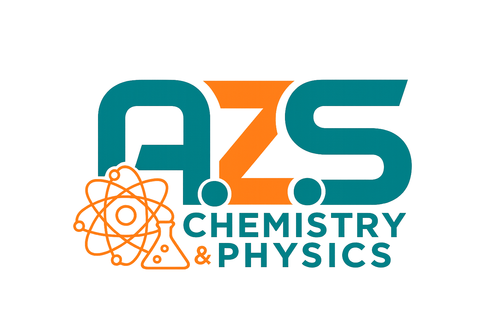

<div align="center">
  
  <h1>AZS: The Catalyst</h1>
  <p><b>Advanced EdTech Student Dashboard, Batch Management & AI Academic Tutor Platform</b></p>
  
  <p>
    
    
    
    
  </p>
</div>

---

## 🚀 Overview

**AZS: The Catalyst** is a modern, high-performance coaching management and student portal platform designed for secondary and higher secondary science education (Physics & Chemistry). It provides an all-in-one ecosystem for seamless video lecture streaming, personal timestamped note-taking, PDF material management, interactive AI tutoring, and an advanced administrative console for automated batch tracking and subscription access control.

---

## ✨ Key Features

### 🎓 Student Portal (`/dashboard`)
* **Progress Tracking & Syllabus Analytics:** Visual chapter progress indicators for Physics and Chemistry modules.
* **Smart Video Streaming & Resume:** Built-in YouTube player with custom watch-status toggling and resume prompts for unfinished classes.
* **Personal Lecture Notes & Timestamps:** Interactive note-taking panel per lecture with instant local autosave and `.txt` export functionality.
* **PDF Document In-App Preview:** Seamless Google Drive and local PDF document viewer for study sheets and practice problem sets.
* **Integrated AI Academic Tutor:** Dedicated conversational assistant to clarify scientific concepts, formulas, and theories on the fly.
* **Interactive Study Planner Calendar:** Custom calendar scheduler to set study goals, daily revision tasks, and automated deadline reminders.

### 🛠️ Instructor & Admin Console (`/admin`)
* **Batch Registry & Filtering:** Instant student segregation by custom batch numbers (e.g., *Batch 01*) with real-time searching.
* **Subscription & Fee Control:** One-click approval system granting 30-day rolling access passes with automated expiration tracking.
* **Syllabus & Chapter Sequence Manager:** Drag/swap and auto-renumbering capabilities (`1..N`) for course lectures.
* **Multi-Format Material Upload:** Support for direct local PC PDF uploads and Google Drive link attachments.

---

## 🛠️ Tech Stack

* **Frontend:** Next.js (App Router), React, Tailwind CSS, Lucide Icons, Axios.
* **Backend:** Python FastAPI, Pydantic, SQLAlchemy, JWT Authentication.
* **Database:** Neon Serverless PostgreSQL.
* **Hosting & Deployment:** Vercel (Frontend) & Render (Backend).

---

## 📁 Project Structure

```text
AZS-The-Catalyst/
├── backend/               # FastAPI REST API & Database Models
│   ├── app/
│   │   ├── api/           # Auth, Academic & AI routers
│   │   └── models/        # SQLAlchemy database schemas
│   └── main.py            # Application entry point
└── frontend/              # Next.js Client Application
    ├── public/            # Static assets (logo.png)
    └── src/
        └── app/
            ├── admin/     # Instructor Console page
            ├── dashboard/ # Student Portal page
            ├── login/     # Secure authentication page
            └── register/  # Student onboarding page
